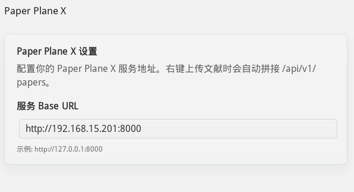
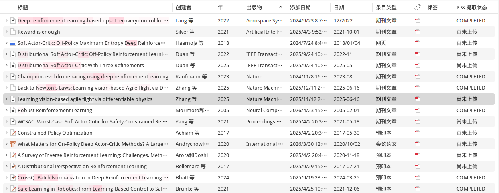
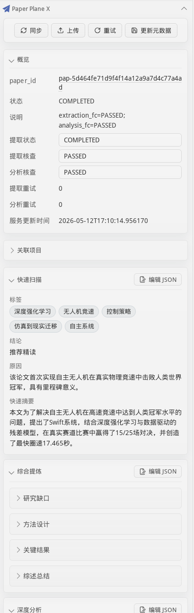

# Paper Plane X Zotero Plugin

Zotero 7+ 插件，连接 [Paper Plane X 后端](https://github.com/WindLX/paper_plane_x)。

## 安装

下载 `.xpi`，Zotero → Tools → Plugins → Install Plugin From File。

源码构建：

```bash
npm install && npm run build
# .scaffold/build/*.xpi
```

## 配置

Zotero Preferences → Paper Plane X：**Service Base URL** 填后端地址，如 `http://127.0.0.1:8000`，不加 `/api/v1`。



配置完成后，插件会在右键上传、项目关联、状态同步等操作中自动拼接后端 API 地址。

## 功能

### 右键菜单

| 操作     | 入口                               | 说明                                                               |
| -------- | ---------------------------------- | ------------------------------------------------------------------ |
| 上传     | 右键条目 → Upload to Paper Plane X | 支持批量。选中多个条目批量上传，有进度条。无 PDF 附件的条目会跳过  |
| 关联项目 | 右键条目 → Link Paper to Project   | 支持批量。已上传的条目弹出项目选择对话框，选中后批量关联到目标项目 |

### 条目列表

条目列表新增 "Paper Plane Status" 列，显示每个条目的处理状态。首次上传后自动出现。



这一列会把后端处理状态带回 Zotero，例如 `COMPLETED` 或“尚未上传”，方便在文献库列表里快速区分哪些论文已经进入 Paper Plane X 流水线。

### 信息面板

选中条目后，右侧信息面板新增 "Paper Plane X" 标签页。



这个面板是 Zotero 内的主要工作区：你可以同步后端数据、上传当前条目 PDF、手动校正处理状态，并查看由 Paper Plane X 抽取和分析出的结构化结果。

**操作栏**

| 按钮            | 作用                               |
| --------------- | ---------------------------------- |
| Sync            | 拉取后端最新数据，刷新面板和状态列 |
| Upload          | 上传当前条目的 PDF 到后端          |
| Retry           | 让后端重新解析                     |
| Update Metadata | 将面板中手动修改的字段写回后端     |

**摘要面板**

显示 paper_id、处理状态、消息。`extraction_status`、`extraction_fact_check_status`、`analysis_fact_check_status` 三个字段可手动覆盖（用于人工校正）。

**项目关联面板**

列出条目所属的后端项目，每个项目旁有 Unlink 按钮。底部输入框可输入 project_id 关联新增项目。

**Quick Scan**

可折叠面板，显示 tags、verdict、reason、quick_summary。右上角编辑按钮打开 JSON 编辑器。

**Synthesis Data**

可折叠面板，包含 research_gap（context / existing_limit / motivation）、methodology（approach_name / core_logic / innovation / disadvantage / future_direction）、key_results（dataset_env / baseline / performance）、review_summary。各字段显示原始文本及引用标注。右上角编辑按钮打开 JSON 编辑器。

**Analysis Report**

可折叠面板，包含 prerequisites（concept_name / brief_explanation / relevance_to_paper）、core_formulation（problem_definition / objective_function / algorithm_flow）、derivation_steps（step_name / detail_explanation）、related_references（title / reason）。右上角编辑按钮打开 JSON 编辑器。

**Fact Check**

可折叠面板，显示 extraction 和 analysis 的事实核查结果。不可手动编辑。

### JSON 编辑器

编辑 quick_scan、synthesis_data、analysis_report 时弹出独立对话框。带行号、Ctrl+S 保存、JSON 格式校验。保存后写回后端。

## 开发

```bash
npm install
npm start         # 启动 Zotero + 热加载
npm run build     # 构建
npm test
npm run lint:fix
```

依赖：Zotero 7、Node.js LTS、npm。
